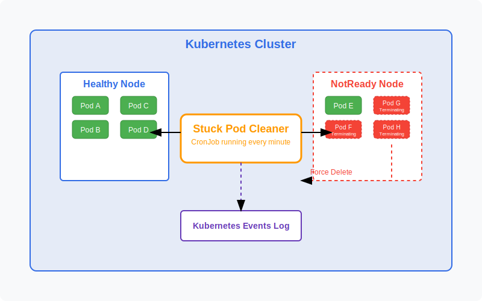
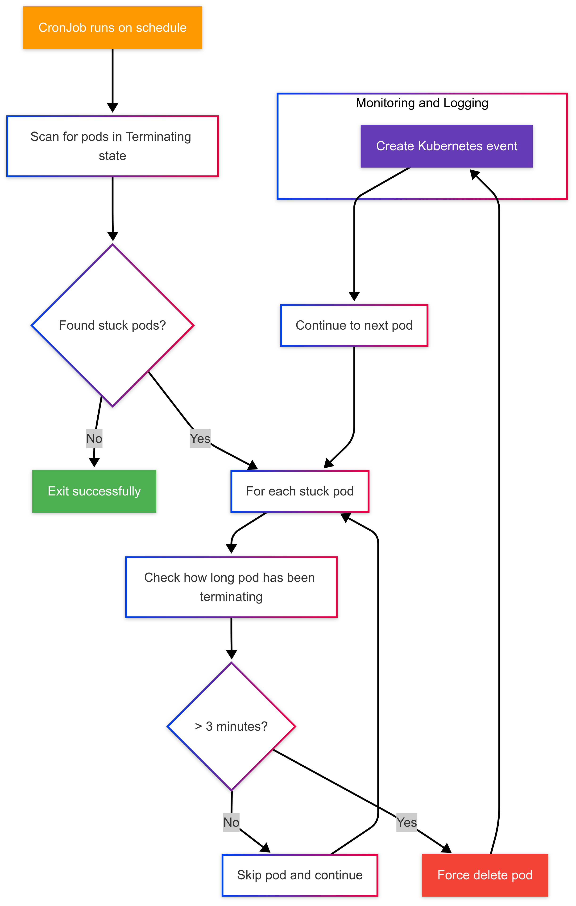

# 🧹 k8s-stuck-pod-cleaner

A Kubernetes CronJob that automatically cleans up pods stuck in Terminating state.



## 🚨 Problem

In Kubernetes clusters, pods can sometimes get stuck in the Terminating state, especially when nodes become unhealthy. This can cause resource leaks, block deployments, and create critical situations in production environments.

## ✅ Solution

This project provides a simple yet effective solution: a Kubernetes CronJob that:
- 🔄 Runs on a configurable schedule (default: every minute)
- 🔍 Detects pods stuck in Terminating state
- ⏱️ Force deletes them after a configurable time threshold (default: 3 minutes)
- 📝 Creates Kubernetes events for audit and tracking

## ⚙️ How It Works



The stuck pod cleaner follows this process:

1. **🕒 Scheduled Execution**: The CronJob runs on a configurable schedule (default: every minute)

2. **🔎 Pod Discovery**: The job scans all pods across the cluster (or selected namespaces) to find those in the "Terminating" state

3. **⏳ Time Analysis**: For each terminating pod, it calculates how long the pod has been in that state

4. **🧠 Cleanup Decision**: Pods that have been stuck for longer than the threshold (default: 3 minutes) are force deleted

5. **📊 Audit Trail**: Kubernetes events are created to maintain a record of which pods were force deleted

### 🔧 Technical Implementation

The solution is implemented as a Kubernetes CronJob that runs a container with the kubectl tool. This approach requires minimal resources and dependencies.

#### Key Components:

- **⏰ CronJob**: Provides the scheduling mechanism
- **🔑 ServiceAccount**: Provides the necessary permissions
- **👑 ClusterRole/ClusterRoleBinding**: Grants permission to list/delete pods and create events
- **💻 Bash Script**: Contains the logic for identifying and cleaning up stuck pods

## 📦 Installation

### Option 1: Apply YAML directly

```bash
kubectl apply -f https://raw.githubusercontent.com/omarmfathy219/k8s-stuck-pod-cleaner/main/stuck-pod-cleaner.yaml
```

### Option 2: Install using Helm

```bash
# Add the repository
helm repo add omarmfathy219 https://omarmfathy219.github.io/helm-charts/

# Install the chart
helm install stuck-pod-cleaner omarmfathy219/stuck-pod-cleaner

# Or install with custom values
helm install stuck-pod-cleaner omarmfathy219/stuck-pod-cleaner --set podDeletion.minTimeBeforeDeletion=5
```

## ⚙️ Configuration

### YAML Configuration

The default configuration:
- 🕐 Runs every minute
- 🌐 Scans all namespaces
- ⏱️ Force deletes pods that have been in Terminating state for more than 3 minutes

You can customize these settings by editing the YAML file before applying it.

### Helm Configuration

When using Helm, you can customize the installation using values:

| Parameter | Description | Default |
|-----------|-------------|---------|
| `namespace` | Namespace where the cleaner is deployed | `kube-system` |
| `namespaces.scanAll` | Whether to scan all namespaces | `true` |
| `namespaces.include` | List of namespaces to scan (if scanAll is false) | `[]` |
| `namespaces.exclude` | List of namespaces to exclude from scanning | `[]` |
| `cronJob.schedule` | CronJob schedule | `* * * * *` (every minute) |
| `podDeletion.minTimeBeforeDeletion` | Time threshold in minutes before force deletion | `3` |
| `podDeletion.createEvents` | Whether to create Kubernetes events | `true` |
| `resources.limits/requests` | Pod resource limits and requests | See values.yaml |

For a full list of configurable options, see the `values.yaml` file.

## 🔒 Security Considerations

- 🛡️ The solution follows least privilege principles, requesting only the permissions it needs
- 👤 The pod runs with a non-root user and a read-only filesystem when using Helm
- 📊 Resource limits prevent the cleaner from consuming excessive cluster resources

## 🔍 Troubleshooting

If you're experiencing issues with the cleaner, here are some common troubleshooting steps:

1. Check the CronJob logs:
   ```
   kubectl logs -n kube-system -l app=stuck-pod-cleaner
   ```

2. Verify RBAC permissions:
   ```
   kubectl auth can-i delete pods --as=system:serviceaccount:kube-system:pod-cleaner
   kubectl auth can-i create events --as=system:serviceaccount:kube-system:pod-cleaner
   ```

3. Check CronJob history:
   ```
   kubectl get jobs -n kube-system
   ```

## 📁 Repository Structure

```
.
├── README.md
├── stuck-pod-cleaner.yaml     # Standalone YAML for direct application
├── docs/                      # Documentation assets
│   ├── architecture.svg       # Architecture diagram
│   └── workflow.png           # Workflow diagram
├── charts/                    # Helm chart directory
│   └── stuck-pod-cleaner/
│       ├── Chart.yaml         # Chart metadata
│       ├── values.yaml        # Default configuration values
│       └── templates/         # Chart templates
│           ├── cronjob.yaml   # Main CronJob definition
│           ├── rbac.yaml      # RBAC resources
│           └── NOTES.txt      # Installation notes
├── examples/
│   └── custom-configuration.yaml
├── CONTRIBUTING.md
└── LICENSE
```

## 👥 Contributing

Contributions are welcome! Please see [CONTRIBUTING.md](CONTRIBUTING.md) for details.

## 📄 License

This project is licensed under the MIT License - see the [LICENSE](LICENSE) file for details.